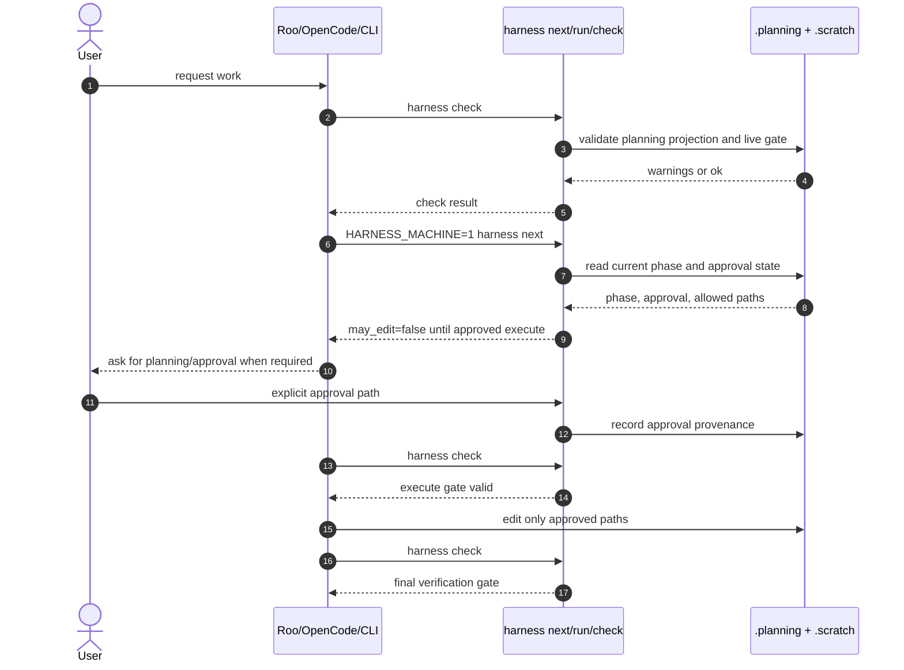

# v0.8.0 Minimal Workflow Sequence

This diagram shows the normal user and adapter path. Low-level phase, nonce,
anchor, repair, and autopilot commands remain advanced/debug/CI internals.

```mermaid
sequenceDiagram
    autonumber
    actor User
    participant Adapter as Roo/OpenCode/CLI
    participant Harness as harness next/run/check
    participant State as .planning + .scratch

    User->>Adapter: request work
    Adapter->>Harness: harness check
    Harness->>State: validate planning projection and live gate
    State-->>Harness: warnings or ok
    Harness-->>Adapter: check result
    Adapter->>Harness: HARNESS_MACHINE=1 harness next
    Harness->>State: read current phase and approval state
    State-->>Harness: phase, approval, allowed paths
    Harness-->>Adapter: may_edit=false until approved execute
    Adapter-->>User: ask for planning/approval when required
    User->>Harness: explicit approval path
    Harness->>State: record approval provenance
    Adapter->>Harness: harness check
    Harness-->>Adapter: execute gate valid
    Adapter->>State: edit only approved paths
    Adapter->>Harness: harness check
    Harness-->>Adapter: final verification gate
```

