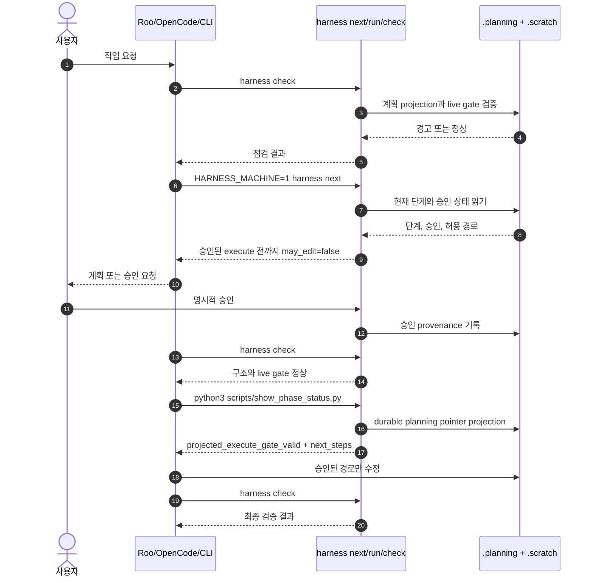

# v0.8 최소 워크플로 시퀀스

이 문서는 일반 사용자와 Roo/OpenCode 어댑터가 따라야 하는 정상 흐름을 보여줍니다. `phase`, nonce, anchor, state repair, autopilot 같은 저수준 명령은 고급/디버그/CI 내부 표면으로 남깁니다.

```mermaid
sequenceDiagram
    autonumber
    actor 사용자
    participant 어댑터 as Roo/OpenCode/CLI
    participant 하네스 as harness next/run/check
    participant 상태 as .planning + .scratch

    사용자->>어댑터: 작업 요청
    어댑터->>하네스: harness check
    하네스->>상태: 계획 projection과 live gate 검증
    상태-->>하네스: 경고 또는 정상
    하네스-->>어댑터: 점검 결과
    어댑터->>하네스: HARNESS_MACHINE=1 harness next
    하네스->>상태: 현재 단계와 승인 상태 읽기
    상태-->>하네스: 단계, 승인, 허용 경로
    하네스-->>어댑터: 승인된 execute 전까지 may_edit=false
    어댑터-->>사용자: 계획 또는 승인 요청
    사용자->>하네스: 명시적 승인
    하네스->>상태: 승인 provenance 기록
    어댑터->>하네스: harness check
    하네스-->>어댑터: 구조와 live gate 정상
    어댑터->>하네스: python3 scripts/show_phase_status.py
    하네스->>상태: durable planning pointer projection
    하네스-->>어댑터: projected_execute_gate_valid + next_steps
    어댑터->>상태: 승인된 경로만 수정
    어댑터->>하네스: harness check
    하네스-->>어댑터: 최종 검증 결과
```
