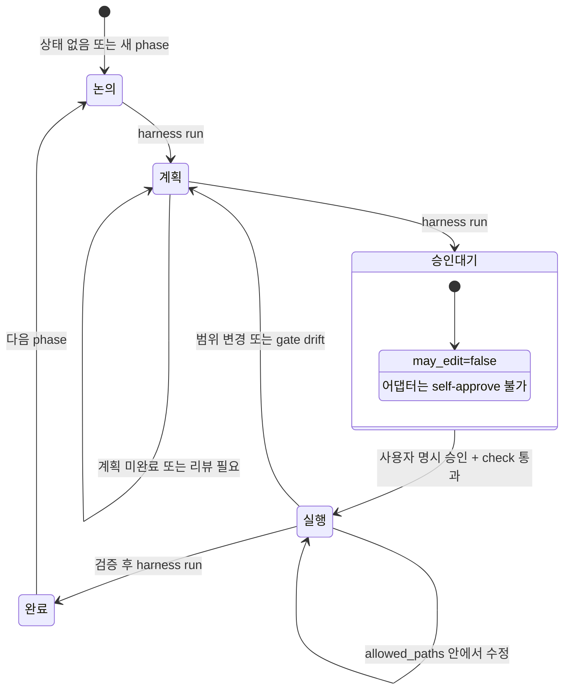

# v0.8 최소 워크플로 상태 머신

일반 사용자가 기억할 명령은 `harness`, `harness next`, `harness run`, `harness check` 네 개입니다. `harness run`은 안전한 워크플로 전환만 진행하고, 구현 작업은 사람 승인이 기록될 때까지 멈춥니다.

## 머신 JSON 계약

`HARNESS_MACHINE=1 harness next`, `HARNESS_MACHINE=1 harness run`, `HARNESS_MACHINE=1 harness check`는 하나의 JSON 객체를 반환합니다.

| 필드 | 값 |
| --- | --- |
| `status` | `ok`, `blocked`, `error` |
| `phase` | 현재 live phase. 상태를 읽을 수 없을 때만 `unknown` |
| `may_edit` | 승인된 execute gate가 유효할 때만 `true` |
| `boundary` | `read-only`, `plan-before-edit`, `approval-required`, `execute-approved` |
| `requires_user_approval` | 어댑터가 멈추고 사용자 승인을 요청해야 하면 `true` |
| `next_command` | `harness run`, `harness next`, 또는 `null` |
| `next_user_prompt` | 사용자에게 보여줄 승인 안내문, 없으면 `null` |
| `warnings` | 점검/상태 진단 목록. 정상 성공 시 빈 배열 |

