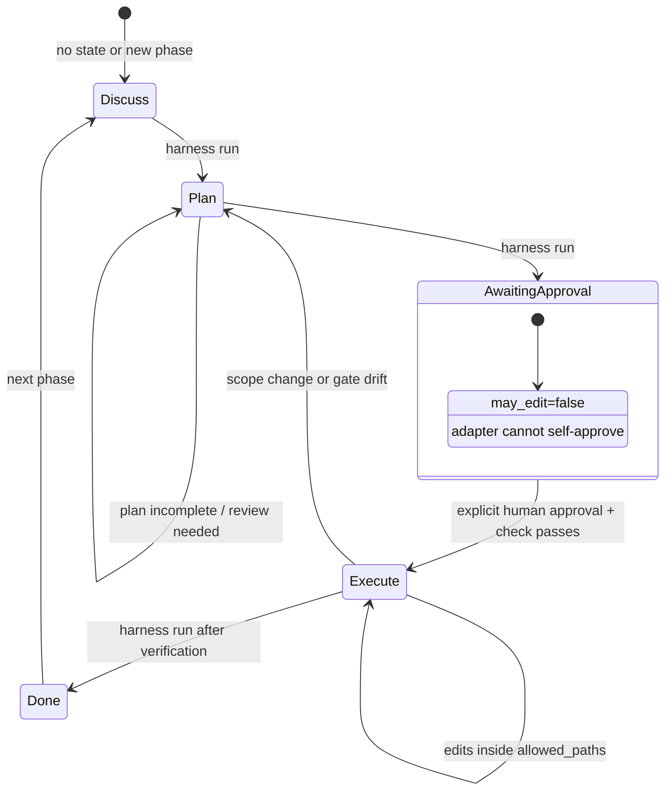

# v0.8.0 Minimal Workflow State Machine

The four normal commands are `harness`, `harness next`, `harness run`, and
`harness check`. `harness run` advances only safe workflow transitions and
stops before implementation until human approval is recorded.

## Machine JSON Contract

`HARNESS_MACHINE=1 harness next`, `HARNESS_MACHINE=1 harness run`, and
`HARNESS_MACHINE=1 harness check` return one JSON object:

| Field | Values |
| --- | --- |
| `status` | `ok`, `blocked`, or `error` |
| `phase` | current live phase, or `unknown` only when state cannot be read |
| `may_edit` | `true` only for a valid approved execute gate |
| `boundary` | `read-only`, `plan-before-edit`, `approval-required`, or `execute-approved` |
| `requires_user_approval` | `true` when the adapter must stop and ask the user |
| `next_command` | `harness run`, `harness next`, or `null` |
| `next_user_prompt` | user-facing approval prompt, or `null` |
| `warnings` | list of check/status diagnostics; empty on clean success |

