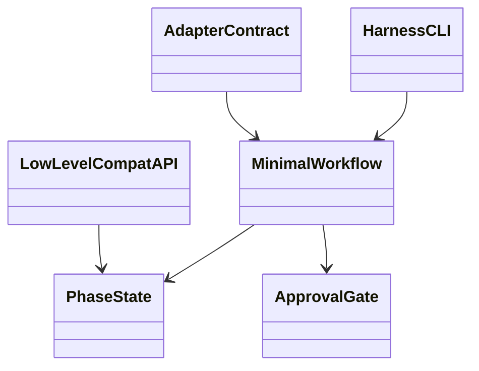
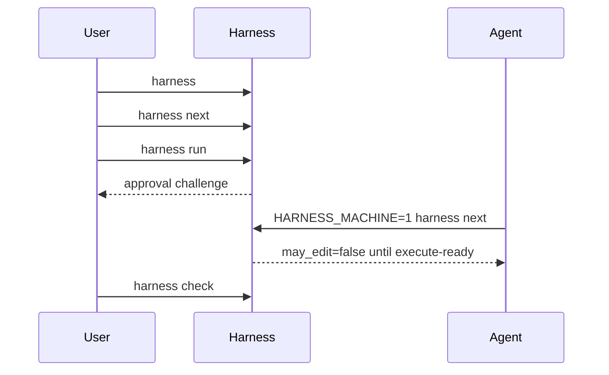

# v0.8.0 Minimal Workflow Implementation Plan

> **For agentic workers:** REQUIRED SUB-SKILL: Use superpowers:subagent-driven-development (recommended) or superpowers:executing-plans to implement this plan task-by-task. Steps use checkbox (`- [ ]`) syntax for tracking.

**Goal:** Ship v0.8.0 with a four-command normal workflow while preserving hard approval, adapter, JSON, release, and security boundaries.

**Architecture:** Keep low-level v0.7.2 commands for compatibility, but add a high-level workflow layer for `harness`, `harness next`, `harness run`, and `harness check`. Human output is prose; adapter output is pinned JSON selected by `HARNESS_MACHINE=1`.

**Tech Stack:** Python argparse CLI in `scripts/harness.py`, workflow helpers in `scripts/lib/`, unittest/pytest-compatible tests, markdown docs, Roo/OpenCode adapter prompt files.

---

## Gate

Do not implement this plan until the live phase gate names v0.8.0 work, reports `phase=execute`, `approved=true`, and includes the touched paths.

Current design evidence:

- Active design: `docs/superpowers/specs/2026-05-19-v0.8.0-minimal-workflow-design.md`
- v0.8 index: `docs/superpowers/specs/v0.8.0_todo/README.md`
- Claude third review: GO for implementation planning, no design blockers.
- gpt-5.5 review: GO for implementation planning, no design blockers.

## File Structure

Modify:

- `scripts/harness.py` - argparse registration and dispatch for bare `harness`, `run`, and machine mode.
- `scripts/lib/status_next_cli.py` - shared repo-root/state loading and high-level command handlers.
- `scripts/lib/status_next.py` - pure status/next/result formatting where reusable.
- `scripts/lib/check.py` - expose normal no-flag check behavior for `harness check`.
- `scripts/lib/phase_approve.py` or a new `scripts/lib/workflow_run.py` - TTY approval challenge and execute transition orchestration.
- `scripts/test_cli_contract.py` - high-level machine JSON golden tests.
- `scripts/fixtures/cli_contract/*.json` - goldens for `HARNESS_MACHINE=1 harness next/run/check`.
- `scripts/test_harness.py` or new focused tests under `tests/cli/` - human output, error scrub, non-TTY approval refusal.
- `.roo/commands/*.md`, `.roo/rules/*.md`, `.opencode/commands/*.md` - adapter prompts to high-level machine flow.
- `README.md` and `docs/USER_MANUAL.md` - teach simplified workflow first.
- `docs/v0.8.0-internal-architecture-uml.md` - internal UML.
- `docs/v0.8.0-installed-user-workflow-uml.md` - installed-user UML.
- `CHANGELOG.md` - v0.8.0 release notes.

Do not remove existing low-level commands in v0.8.0.

## Task 1: High-Level Machine Contract Goldens

**Files:**
- Modify: `scripts/test_cli_contract.py`
- Create: `scripts/fixtures/cli_contract/high_level_next_blocked.json`
- Create: `scripts/fixtures/cli_contract/high_level_run_blocked.json`
- Create: `scripts/fixtures/cli_contract/high_level_check_ok.json`

- [ ] **Step 1: Add failing tests**

Add tests that run commands with `HARNESS_MACHINE=1` and assert JSON equality through the existing `_normalize()` helper:

```python
def test_high_level_next_machine_matches_golden(self) -> None:
    r = self._run(["next"], extra_env={"HARNESS_MACHINE": "1"})
    got = _normalize(json.loads(r.stdout))
    expected = _normalize(json.loads((FIX / "high_level_next_blocked.json").read_text()))
    self.assertEqual(got, expected)

def test_high_level_run_machine_blocks_without_human_approval(self) -> None:
    r = self._run(["run"], extra_env={"HARNESS_MACHINE": "1"}, check=False)
    self.assertNotEqual(r.returncode, 0)
    got = _normalize(json.loads(r.stdout))
    expected = _normalize(json.loads((FIX / "high_level_run_blocked.json").read_text()))
    self.assertEqual(got, expected)

def test_high_level_check_machine_matches_golden(self) -> None:
    r = self._run(["check"], extra_env={"HARNESS_MACHINE": "1"})
    got = _normalize(json.loads(r.stdout))
    expected = _normalize(json.loads((FIX / "high_level_check_ok.json").read_text()))
    self.assertEqual(got, expected)
```

If `_run()` does not accept `extra_env` or `check`, extend it minimally.

- [ ] **Step 2: Run the focused contract tests**

Run:

```bash
python3 -m unittest scripts/test_cli_contract.py
```

Expected: FAIL because `run` and `HARNESS_MACHINE=1` contracts do not exist yet.

- [ ] **Step 3: Add initial golden shapes**

Use stable schema fields:

```json
{
  "status": "blocked",
  "phase": "plan",
  "may_edit": false,
  "boundary": "approval_required",
  "requires_user_approval": true,
  "next_command": "harness run",
  "next_user_prompt": "Run harness run from a local interactive terminal to approve the current plan.",
  "warnings": []
}
```

Adjust only fixture values that are inherently phase-specific. Do not include timestamps or absolute paths.

- [ ] **Step 4: Commit after implementation and passing tests**

Commit message:

```bash
test: pin high-level workflow machine contracts
```

## Task 2: High-Level Command Behavior

**Files:**
- Modify: `scripts/harness.py`
- Modify: `scripts/lib/status_next_cli.py`
- Modify: `scripts/lib/status_next.py`
- Create: `scripts/lib/workflow_run.py`

- [ ] **Step 1: Add argparse support**

In `scripts/harness.py`, add:

```python
run_parser = subparsers.add_parser("run", help="Run the next safe workflow action.")
run_parser.set_defaults(command="run")
```

Allow no subcommand by detecting `args.command is None` and dispatching to a new bare handler.

- [ ] **Step 2: Add machine-mode detection**

Create a helper:

```python
def is_machine_mode() -> bool:
    return os.environ.get("HARNESS_MACHINE") == "1"
```

Use it for `next`, `run`, and `check`; do not infer machine mode from TTY state.

- [ ] **Step 3: Implement bare `harness`**

Bare `harness` is read-only:

```python
def cmd_dashboard(args) -> int:
    # Load current state through the same preflight path as status/next.
    # Print concise human guidance only.
    # Return non-zero for absent, malformed, or blocked state.
```

Human output must not contain `.scratch/phase-state.json`, `state show`, `state repair`, `phase set`, `phase approve`, or `approve-nonce`.

- [ ] **Step 4: Implement `harness run`**

In `scripts/lib/workflow_run.py`, implement:

```python
def cmd_run(args) -> int:
    if is_machine_mode():
        return _run_machine(args)
    if not _has_controlling_tty():
        return _blocked_human("Run harness run from a local interactive terminal.")
    return _run_human_tty(args)
```

Human approval must require `approve <plan-id> <challenge>` from the controlling terminal, not piped stdin. After recording approval, stop and print the next high-level command; do not continue into execute in the same invocation.

- [ ] **Step 5: Run focused tests**

Run:

```bash
python3 -m unittest scripts/test_cli_contract.py
python3 -m unittest scripts/test_harness.py
```

Expected: contract tests pass; unrelated legacy tests still pass.

- [ ] **Step 6: Commit**

```bash
git commit -m "feat: add minimal workflow command layer"
```

## Task 3: Approval Safety and Error Scrub Tests

**Files:**
- Modify: `scripts/test_harness.py` or create `tests/cli/test_minimal_workflow.py`

- [ ] **Step 1: Add tests for non-TTY approval refusal**

Test that piped input cannot approve:

```python
def test_run_rejects_piped_approval(self):
    result = subprocess.run(
        [sys.executable, str(HARNESS), "run"],
        input="yes\n",
        text=True,
        capture_output=True,
        cwd=str(self.repo),
    )
    self.assertNotEqual(result.returncode, 0)
    self.assertNotIn("may_edit\": true", result.stdout)
```

- [ ] **Step 2: Add output scrub tests**

Assert normal output and normal docs do not expose banned internals:

```python
BANNED_NORMAL = [
    ".scratch/phase-state.json",
    "state show",
    "state repair",
    "phase set",
    "phase approve",
    "phase reopen",
    "approve-nonce",
    "anchor repair",
    "fsd-run-phase",
    "fsd-run-all",
]
```

Run `harness`, `harness next`, `harness run`, and `harness check` in representative blocked states and assert banned terms are absent from stdout/stderr.

- [ ] **Step 3: Run focused tests**

Run:

```bash
python3 -m unittest scripts/test_harness.py
pytest tests/cli tests/slash
```

- [ ] **Step 4: Commit**

```bash
git commit -m "test: protect minimal workflow approval and output"
```

## Task 4: README, Manual, and UML Docs

**Files:**
- Modify: `README.md`
- Modify: `docs/USER_MANUAL.md`
- Create: `docs/v0.8.0-internal-architecture-uml.md`
- Create: `docs/v0.8.0-installed-user-workflow-uml.md`

- [ ] **Step 1: Rewrite primary docs to teach simplified workflow first**

The normal transcript must fit on one screen:

```bash
harness
harness next
harness run
harness check
```

Do not include flags in the normal path.

- [ ] **Step 2: Move internals to advanced sections**

Move or re-label low-level phase, state, nonce, anchor, release, and repair commands as advanced/debug/CI/security.

- [ ] **Step 3: Add UML internal architecture doc**

Use Mermaid UML showing:



- [ ] **Step 4: Add UML installed-user workflow doc**

Use Mermaid sequence diagram:



- [ ] **Step 5: Run doc scrub tests**

Run the tests added in Task 3 and confirm README/manual normal sections are clean.

- [ ] **Step 6: Commit**

```bash
git commit -m "docs: teach v0.8 minimal workflow first"
```

## Task 5: Adapter Prompt Rewrite

**Files:**
- Modify: `.roo/commands/phase-discuss.md`
- Modify: `.roo/commands/phase-plan.md`
- Modify: `.roo/commands/phase-execute.md`
- Modify: `.roo/commands/fsd-run-phase.md`
- Modify: `.roo/commands/fsd-run-all.md`
- Modify: `.roo/rules/phase-gate.md`
- Modify: `.opencode/commands/discuss.md`
- Modify: `.opencode/commands/plan.md`
- Modify: `.opencode/commands/execute.md`
- Modify: `.opencode/commands/fsd-run-phase.md`
- Modify: `.opencode/commands/fsd-run-all.md`

- [ ] **Step 1: Replace low-level phase instructions**

Adapter happy path becomes:

```text
Run `HARNESS_MACHINE=1 harness next`.
Run `HARNESS_MACHINE=1 harness run` only when the machine response says it is the next command.
Proceed with edits only when the machine response says `status=ok` and `may_edit=true`.
Before final response, run `HARNESS_MACHINE=1 harness check`.
If any response is blocked or error, show `next_user_prompt` to the user and stop.
```

- [ ] **Step 2: Remove adapter reliance on internals**

Do not instruct adapters to inspect `.scratch/phase-state.json`, call `phase set`, call `phase approve`, reason over durable pointers, or directly interpret `allowed_paths`.

- [ ] **Step 3: Update slash/adaptor tests**

Update existing literal body tests under `tests/slash/` and adapter artifact tests so the prompt contracts match the high-level flow.

- [ ] **Step 4: Run adapter tests**

Run:

```bash
pytest tests/slash tests/cli/test_roo_modes_single_source.py
python3 -m unittest scripts/test_adapter_artifacts.py
```

- [ ] **Step 5: Commit**

```bash
git commit -m "feat: route adapters through minimal workflow contract"
```

## Task 6: Compatibility, Release Checks, and Version

**Files:**
- Modify: `harness/manifest.json`
- Modify: `CHANGELOG.md`
- Modify version-bearing files found by `scripts/harness.py release-check`

- [ ] **Step 1: Preserve low-level command compatibility**

Run:

```bash
python3 -m unittest scripts/test_cli_contract.py
python3 -m unittest scripts/test_harness.py
pytest
```

Expected: existing JSON, migration, nonce, trust, audit, adapter, and slash tests pass or are updated with intentional v0.8 goldens.

- [ ] **Step 2: Run harness checks**

Run:

```bash
python3 scripts/harness.py check
python3 scripts/harness.py check --worktree
python3 scripts/release_smoke_test.py
```

- [ ] **Step 3: Update version and changelog**

Set release version to `v0.8.0`, then run:

```bash
python3 scripts/harness.py release-check --expected-version v0.8.0
```

- [ ] **Step 4: Commit**

```bash
git commit -m "release: prepare v0.8.0"
```

## Task 7: Specialist and Claude Final Reviews

**Files:**
- Create: `.review/v0.8.0-cli-ux-review.md`
- Create: `.review/v0.8.0-workflow-safety-review.md`
- Create: `.review/v0.8.0-adapter-consistency-review.md`
- Create: `.review/v0.8.0-docs-onboarding-review.md`
- Create: `.review/v0.8.0-release-ci-review.md`
- Create: `.review/v0.8.0-combined-ship-brief.md`

- [ ] **Step 1: Run specialist adversarial reviews**

Cover these scenarios:

- user confusion;
- GPT-4-era agent mistakes;
- CLI bloat;
- adapter drift;
- approval/security regression;
- JSON contract breakage;
- release failure.

- [ ] **Step 2: Accept/reject/defer each finding**

Every finding in the combined brief must be marked:

```text
ACCEPTED - fixed in <commit/test>
REJECTED - reason
DEFERRED - target version and reason
```

- [ ] **Step 3: Run Claude combined review**

Run:

```bash
claude --dangerously-skip-permissions -p "<focused combined ship-blocker review prompt>"
```

- [ ] **Step 4: Fix blockers**

Do not ship with unresolved blockers.

## Task 8: Ship v0.8.0

**Files:**
- Modify only release metadata required by the repo release process.

- [ ] **Step 1: Final audit**

Map every objective requirement to evidence:

- command count;
- normal no-flag transcript;
- adapter minimal flow;
- approval hard boundary tests;
- JSON/machine contract tests;
- README/manual/UML docs;
- specialist and Claude reviews;
- release checks.

- [ ] **Step 2: Run final release process**

Run the repo release commands from README/manual/release docs, including:

```bash
python3 -m unittest scripts/test_harness.py
python3 scripts/harness.py check
python3 scripts/harness.py check --worktree
python3 scripts/release_smoke_test.py
python3 scripts/harness.py release-check --expected-version v0.8.0
```

- [ ] **Step 3: Tag and push via repo process**

Use the existing release process. Confirm the resulting tag is `v0.8.0`.

## Self-Review

Spec coverage:

- Four-command normal surface: Tasks 1-4.
- No flags in normal path: Tasks 2 and 4.
- Adapter high-level flow: Task 5.
- Hard approval/security boundaries: Tasks 1-3 and 6.
- Human/machine split: Tasks 1-3.
- README/manual/UML docs: Task 4.
- Reviews and release: Tasks 7-8.

Known planning constraints:

- Implementation must not start from the current `phase=done`, `approved=false` gate.
- High-level JSON goldens must land before adapter prompt rewrites.
- Error scrub must cover command output, stderr, docs, and adapter prompts.
